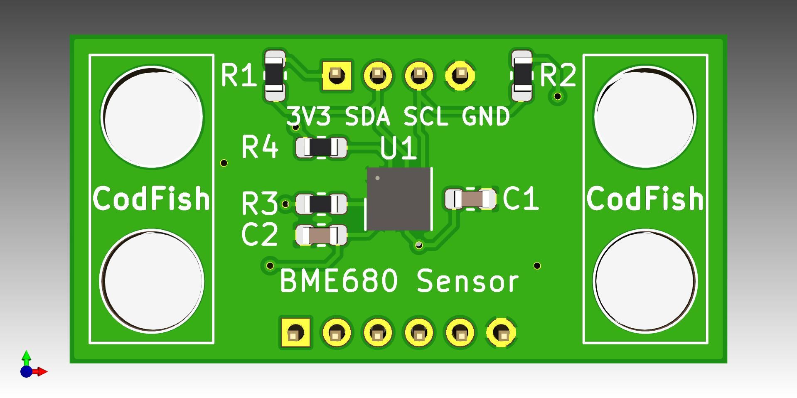
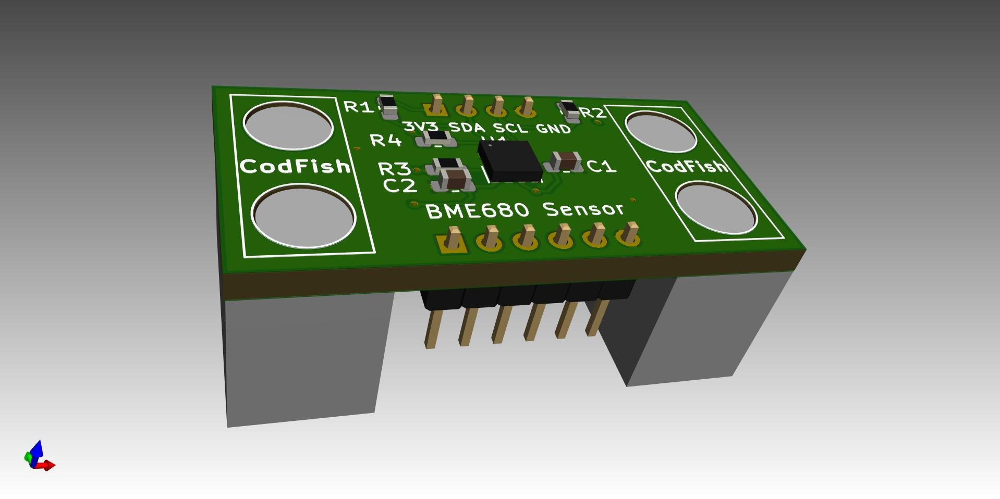
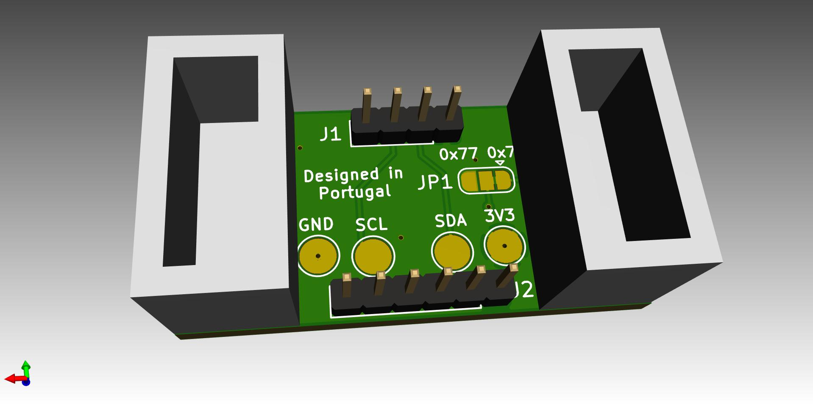

# Internet of Things Sensor Brick (Base Project)

This is the series of sensors for IoT projects, made on base of the famous brick game. This is compatible to the format to be used with others bricks to prototype quickly.

Bosch BME680 Sensor

Sensor | Project Link
------------ | -------------
Bosch BMI160 | [Goto Project](https://github.com/pedrominatel/cf_sensor_brick_model)
Bosch BME680 | [Goto Project](https://github.com/CodFish-pt/sensor_bricks_hardware/tree/main/bme680) 
Texas HDC1080 | Soon

Happy Hacking!
