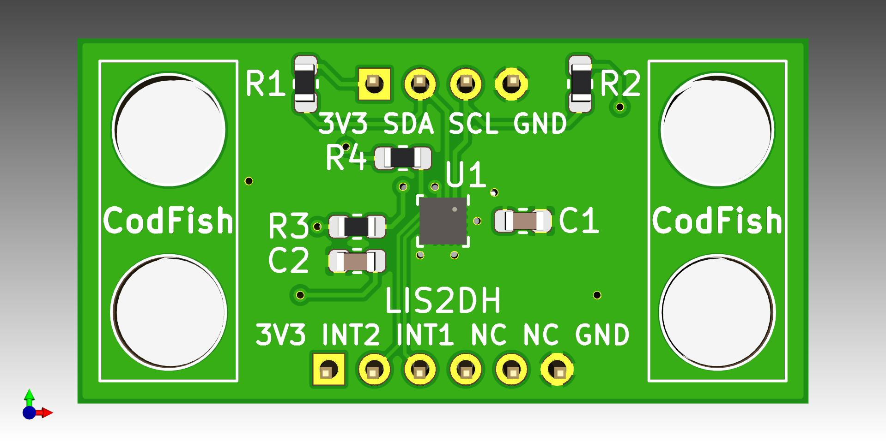
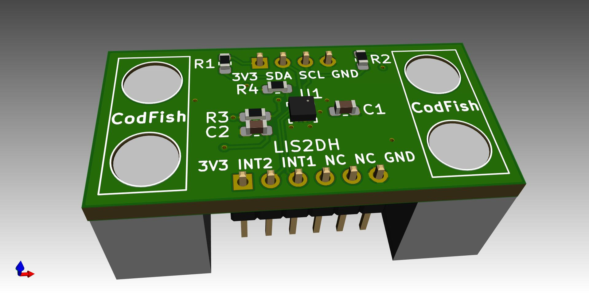
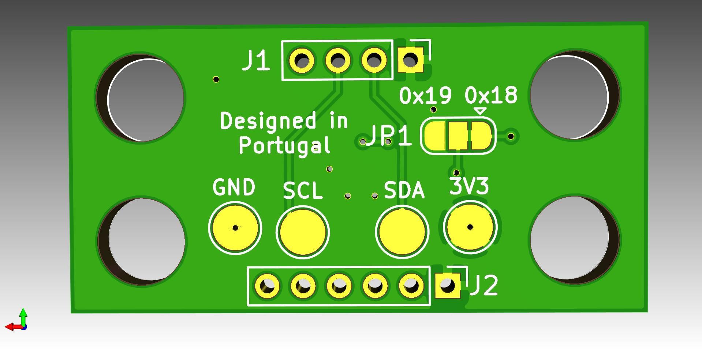

# STM LIS2DH Internet of Things Sensor Brick

This is the series of sensors for IoT projects, made on base of the famous brick game. This is compatible to the format to be used with others bricks to prototype quickly.

STM LIS2DH Sensor

Sensor | Project Link
------------ | -------------
Bosch BMI160 | [Goto Project](https://github.com/pedrominatel/cf_sensor_brick_model)
Bosch BME680 | [Goto Project](https://github.com/CodFish-pt/sensor_bricks_hardware/tree/main/bme680) 
STM LIS2DH | [Goto Project](https://github.com/CodFish-pt/sensor_bricks_hardware/tree/main/lis2dh12)

Happy Hacking!
